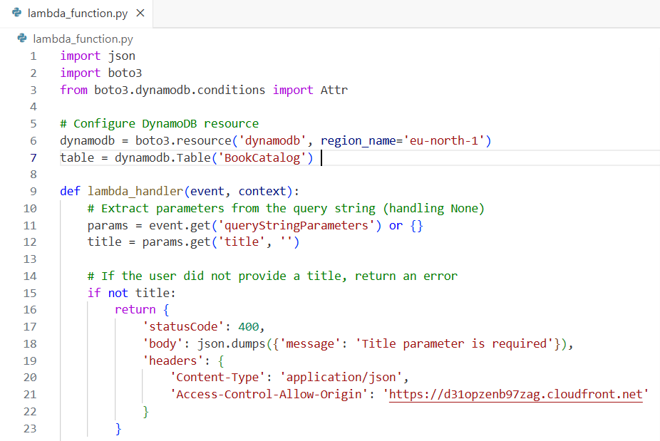

# aws-three-tier-webapp
Mini AWS three-tier web application project with S3, CloudFront, API Gateway, Lambda, DynamoDB and Amazon Translate.

# AWS Three-Tier Web Application Project

I built a simple three-tier web application on AWS.  
The application is a mini book catalog, where the user can search for a title and, if desired, translate the description into their preferred language.

The project was not meant to be a full e-commerce app, but rather a way to *gain practical hands-on experience* with core AWS services, integrated into a coherent flow.

---

## Project Goals
- Apply three-tier architecture concepts (Presentation – Logic – Data).  
- Use key AWS services: S3, CloudFront, API Gateway, Lambda, DynamoDB.  
- Integrate optional value-added services: Amazon Translate and Amazon CloudWatch.  
- Demonstrate basic monitoring and observability (Lambda and DynamoDB metrics).  
- Practice with Python on Lambda.  

---

## Architecture (overview)

- **Frontend Layer** → S3 for static files (HTML, CSS, JS), served via CloudFront.  
- **Application Layer** → API Gateway exposes two REST endpoints; Lambda functions (Python) handle requests (fetch book data + translate description).  
- **Data Layer** → DynamoDB stores the book catalog.  
- **Supporting services** → Amazon Translate for dynamic translations, CloudWatch for monitoring Lambda and DynamoDB metrics/logs.  

  

---

## Main Steps

### 1️. Frontend Layer
- Created an S3 bucket to host the frontend.  
- Configured a CloudFront distribution connected to S3, using Origin Access Control (OAC) for secure content delivery.  
- Built the frontend with HTML + CSS and JavaScript (Fetch API) to call API Gateway endpoints.  

### 2. Application Layer
- Set up a REST API in API Gateway with two resources:  
  - `/books` → retrieves book information.  
  - `/translate` → translates the description using Amazon Translate.  
- Enabled CORS on both endpoints.  
- Implemented two Lambda functions in Python:  
  - `getBook` → queries DynamoDB.  
  - `translateDescription` → invokes Amazon Translate to return the translation.  
- Assigned IAM permissions:  
  - `AmazonDynamoDBReadOnlyAccess` for `getBook`.  
  - `TranslateFullAccess` for `translateDescription`.  
- Tested both functions with real inputs.  

### 3. Data Layer
- Created a DynamoDB table `BookCatalog` with partition key = `BookId`.  
- Since `Title` is not the primary key, I had to use a Scan with filter on Title → this highlighted the importance of good key design in DynamoDB.  

### 4. Monitoring
- Built a CloudWatch dashboard including:  
  - `Invocations`, `Duration`, `Errors` for Lambda.  
  - `Consumed Read Capacity Units / Consumed Write Capacity Units` for DynamoDB.  
- Used Lambda logs in CloudWatch to identify errors and improve code reliability.  

---

## Code
- **Lambda (Python):**  
  - `getBook` → fetches book data from DynamoDB.  
  - `translateDescription` → translates book descriptions with Amazon Translate.  
  - Both functions handle errors and `None` cases.  

- **Frontend (JavaScript):**  
  - Uses `fetch()` to interact with API Gateway.  
  - Displays the original description and translated text when requested.

〰️ Full code is available in the /lambda and /frontend folders of the repository.

  

---

## Demo & Screenshots

⚪ **S3 Bucket with static files** 

 
 
 
 

⚪ **CloudFront Distribution**  

 
 
 
 

⚪ **DynamoDB Table & Item details**  
 

 

 
 
 
 

⚪ **Lambda Function**   
 

 
 
 
 
 

⚪ **API Gateway Configuration**  
 

 
 
 
 
 

⚪ **CloudWatch Dashboard**  
 

 
 
 
 
 
## 📽️ Workflow Demo

.

---

## Tests Performed
- Accessed the web app through CloudFront domain.  
- Book search → successfully retrieved from DynamoDB.  
- Translation → Amazon Translate returned expected output.  
- CloudWatch metrics updated correctly after invocations.  

---

## Lessons Learned
- **DynamoDB** → key design is critical; using Scan is not scalable. A GSI on Title would be a better approach.  
- **API Gateway + Lambda** → CORS and parameter handling are tricky: small misconfigurations can cause `Missing Authentication Token` or `Internal Server Error`.  
- **CloudWatch Logs** → extremely useful for debugging (helped me identify issues with `None` inputs and CORS).  
- **Python on Lambda** → very powerful; I started practicing but plan to study it in more depth.  

---

## Possible Extensions
- Improve frontend UI and expand the book catalog with more data and languages.  
- Analyze user queries using CloudWatch Logs Insights or Athena.  
- Automate deployment with CloudFormation or AWS CDK instead of manual setup.  
